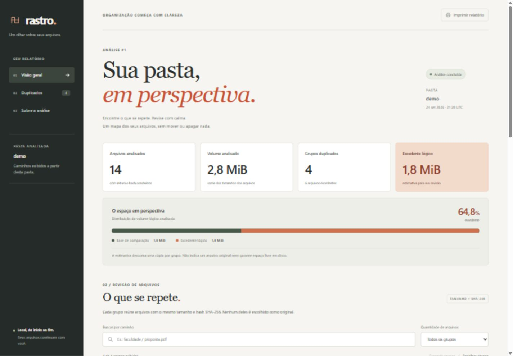

# Rastro · arquivos duplicados

[](https://github.com/fbottega-dev/rastro-arquivos/actions/workflows/ci.yml)

Ferramenta local para estudantes e freelancers que acumulam cópias de trabalhos, entregas e referências. O Rastro analisa o **conteúdo** dos arquivos, mostra grupos duplicados e guarda cada análise para consulta posterior. Nenhum arquivo original é apagado ou movido.

Projeto criado do zero para estudo, com **Python, SQLite e biblioteca padrão**, sem partir de uma aplicação pronta. Código e documentação foram produzidos com apoio de IA e passaram por revisão e testes; isso não representa experiência profissional anterior.



[Captura em celular](docs/mobile.jpg) · [HTML de exemplo para baixar e abrir](docs/demo.html) · [Guia para estudar o código](docs/ESTUDO.md)

## Experimentar

Requisito: **Python 3.12 ou superior**, com `sqlite3` disponível. A distribuição oficial do Python já inclui esse módulo. Não é necessário instalar servidor de banco, Node, Docker ou pacotes Python para executar pela pasta do projeto.

No PowerShell, Bash ou outro terminal:

```sh
git clone https://github.com/fbottega-dev/rastro-arquivos.git
cd rastro-arquivos
python -m rastro demo ./demo
python -m rastro analisar ./demo --html ./relatorio.html
```

Abra `relatorio.html` no navegador. No Windows: `Start-Process ./relatorio.html`. Se o seu sistema usa `python3` ou `py -3.12`, substitua `python` nos comandos. Confirme a versão com `python --version`.

A demonstração cria 15 arquivos fictícios. A análise considera 14, ignora a pasta `.git` e encontra **4 grupos, 6 cópias excedentes e cerca de 1,8 MiB redundantes**. Há arquivos iguais com nomes diferentes, notas com conteúdos diferentes e um arquivo vazio.

```text
Rastro · Análise #1 · concluída
14 arquivos lidos · 2.8 MiB
4 grupos · 6 cópias excedentes · 1.8 MiB redundantes
Estimativa de bytes lógicos. Nenhum arquivo original foi alterado.
```

A pasta `demo` precisa ser nova. Para analisar novamente, use outro nome de relatório, como `--html ./relatorio-2.html`. O mesmo banco acumula análises com IDs novos.

## O que funciona

- Leitura recursiva por blocos de 1 MiB e agrupamento por tamanho + SHA-256.
- Estimativa de bytes redundantes, descontando uma cópia em cada grupo.
- Exclusões por nome, extensão ou padrão de caminho relativo.
- Histórico persistente em SQLite e exportação posterior em HTML ou JSON.
- Relatório responsivo e offline, com busca por caminho, busca sem acentos, filtro de grupos com três ou mais arquivos e expansão dos detalhes.
- Registro de entradas ignoradas e falhas de leitura, com indicação de análise parcial.
- Preservação dos arquivos existentes: a ferramenta não escolhe um “original” nem oferece exclusão automática.

O HTML contém seus próprios estilos e scripts, sem CDN, fontes remotas ou coleta de dados. É um relatório de uma análise já concluída: mudanças na pasta exigem um novo comando `analisar`.

## Usar em outra pasta

```sh
python -m rastro analisar "./minha-pasta" --html ./relatorio-pasta.html --ignorar "*.tmp" --ignorar "backup/*"
python -m rastro historico
python -m rastro exportar 1 --saida ./copia.html
python -m rastro exportar 1 --saida ./resultado.json --formato json
```

Use o ID mostrado no histórico; `1` é apenas o exemplo da primeira análise. A exportação consulta o banco e funciona mesmo que a pasta original não exista mais. O JSON traz versão do formato, arquivos, grupos, resumo e ocorrências.

Por padrão, `.git`, `node_modules`, `.venv` e `__pycache__` são ignorados em qualquer nível. Um padrão sem `/` é comparado com cada componente do caminho; com `/`, com o caminho completo relativo à raiz. Use barras `/` mesmo no Windows. A comparação diferencia maiúsculas de minúsculas; `*.tmp` não exclui `ARQUIVO.TMP`. Esses padrões usam `fnmatch`, não a sintaxe completa de `.gitignore`.

Veja todos os argumentos:

```sh
python -m rastro --help
python -m rastro analisar --help
```

## Banco e arquivos de saída

O banco padrão é `.rastro/historico.sqlite3`, relativo ao diretório em que o comando foi executado. O esquema é criado automaticamente na primeira análise. Não há configuração com credenciais, migrations externas ou seeder: `demo` cria os arquivos de exemplo e `analisar` popula o banco.

Para escolher outro histórico, passe `--banco` em cada comando:

```sh
python -m rastro analisar ./demo --banco ./dados/historico.sqlite3 --html ./outro-relatorio.html
python -m rastro historico --banco ./dados/historico.sqlite3
python -m rastro exportar 1 --banco ./dados/historico.sqlite3 --saida ./outra-copia.html
```

O diretório do banco é criado se necessário. O diretório do relatório deve existir. **O banco e o HTML de `analisar` precisam ficar fora da pasta analisada**, para preservar a origem e evitar analisar as próprias saídas. Para analisar o diretório atual, por exemplo, use `--banco ../historico.sqlite3 --html ../relatorio-atual.html`.

O banco armazena data UTC, nome da pasta, caminhos relativos, tamanhos e hashes; não guarda o conteúdo dos arquivos. Ele tem um identificador próprio e versão de esquema. Arquivos SQLite de outro aplicativo são recusados. Cada análise é salva em uma transação. Os comandos de consulta abrem o banco em modo somente leitura.

O histórico e os relatórios podem conter nomes pessoais de arquivos. Os dados publicados neste repositório vêm somente da demonstração fictícia; o `.gitignore` exclui bancos e saídas usuais.

## Regras e falhas esperadas

| Situação | Comportamento |
| --- | --- |
| Mesmo tamanho e SHA-256 | Os caminhos formam um grupo. |
| Mesmo nome, conteúdo diferente | Arquivos separados. |
| Arquivo com zero bytes | Contado na análise, fora dos grupos. |
| Hardlinks para o mesmo arquivo | A identidade é contada uma vez; os outros caminhos aparecem como ignorados. |
| Link simbólico ou junction | Ignorado; não é percorrido. |
| Arquivo muda durante a leitura | A alteração comum de metadados é detectada e registrada como ocorrência. |
| Arquivo/pasta sem acesso | A análise continua e fica marcada como parcial. |
| Saída já existe | O comando pede outro nome; não sobrescreve. |

| Código de saída | Significado |
| --- | --- |
| `0` | Comando concluído. |
| `2` | Argumento inválido ou erro de execução. |
| `3` | Análise salva, mas parcial por ocorrências de leitura. |
| `130` | Interrupção pelo teclado. |

Se a exportação falhar depois da gravação, o terminal já informa o ID salvo; use `exportar` para tentar novamente. Uma falha ao salvar o banco reverte os registros daquela análise.

## Testes

```sh
python -m unittest discover -s tests -v
python -m compileall -q rastro tests
```

A suíte cobre agrupamento, estimativa, exclusões, Unicode, hardlinks, links simbólicos, arquivos alterados durante leitura, permissões simuladas, transações, identificação do banco, proteção contra sobrescrita, conteúdo HTML malicioso e o fluxo completo dos comandos.

O [GitHub Actions](https://github.com/fbottega-dev/rastro-arquivos/actions) executa a suíte e os comandos de demonstração em **Ubuntu e Windows, com Python 3.12, 3.13 e 3.14**. Testes que precisam criar links simbólicos são pulados quando o sistema nega esse privilégio; isso aparece no resultado. O registro da entrega e das verificações está em [VALIDACAO.md](docs/VALIDACAO.md).

## Por que estas tecnologias

Python facilita automações de arquivos e oferece leitura em blocos, SHA-256, argumentos de terminal, SQLite e testes na própria biblioteca padrão. Ele também amplia um portfólio que já contém Java, C#, PHP e Kotlin.

SQLite persiste o histórico em um arquivo local; um servidor SQL seria desnecessário para uma ferramenta pessoal. HTML, CSS e JavaScript permitem explorar os resultados no navegador sem executar uma aplicação web. Não há API ou serviço remoto.

| Arquivo | Responsabilidade |
| --- | --- |
| `rastro/cli.py` | Argumentos, coordenação dos comandos e mensagens. |
| `rastro/scanner.py` | Travessia, leitura e identificação dos arquivos. |
| `rastro/domain.py` | Agrupamento e cálculo de bytes redundantes. |
| `rastro/storage.py` | Esquema, transações e consultas SQLite. |
| `rastro/report.py` | Transformação dos dados em HTML com escaping. |
| `rastro/assets/` | Estilos e interações incorporados ao relatório. |
| `rastro/demo.py` | Geração dos arquivos fictícios. |
| `tests/` | Testes com pastas e bancos temporários. |

Fundamentos e referências oficiais: [argparse](https://docs.python.org/3/library/argparse.html), [hashlib](https://docs.python.org/3/library/hashlib.html) e [sqlite3](https://docs.python.org/3/library/sqlite3.html). Siga o [guia de estudo](docs/ESTUDO.md) para acompanhar uma análise do comando até o relatório.

## Limitações e um próximo exercício

O resultado usa hashes, sem confirmação byte a byte. Os bytes são lógicos: não prometem espaço físico recuperável. A checagem de metadados não é um snapshot atômico, nem uma proteção completa contra uma pasta modificada de forma adversarial durante a leitura. Prefira analisar uma pasta sem edições em andamento.

Todos os arquivos elegíveis são relidos em cada análise. Os metadados ficam em memória, então o projeto foi pensado para pastas pessoais, não milhões de arquivos. O histórico não compara versões automaticamente e o relatório não acompanha mudanças ao vivo. Não há classificação por similaridade de fotos ou documentos: só conteúdo idêntico por tamanho e hash.

**Exercício sugerido:** adicionar `--minimo-bytes` para ocultar grupos pequenos no relatório, mantendo os totais da análise claramente separados dos totais filtrados. Comece por um teste de fronteira e depois altere domínio, comando e relatório. Veja [as decisões](docs/DECISOES.md) antes de ampliar o escopo.
